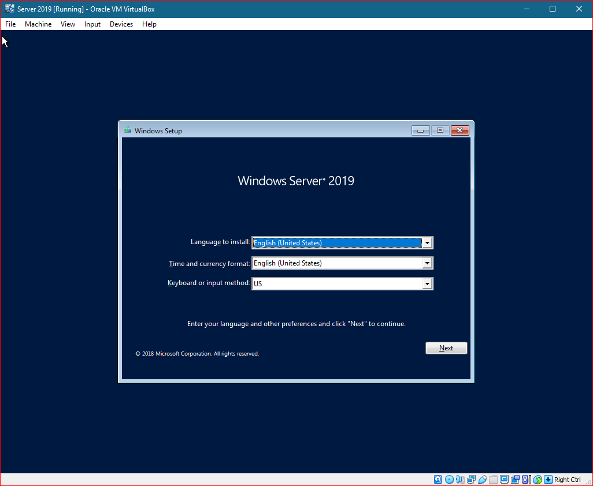

The vast majority of sources I checked while trying to re-work our existing backups use the same basic script that invoke `wbadmin.exe` to initiate an image of the server, but that isn't real powershell and just won't do. I more or less copied my code from the [official docs for Start-WBBackup](https://docs.microsoft.com/en-us/powershell/module/windowsserverbackup/start-wbbackup?view=windowsserver2022-ps). 

I added a timer into my script because this tends to take a while and if you see a large variation in the time you may be alerted to other issues you have in your infrastructure which is nice.

## Code 
%% 
https://gist.github.com/PipeItToDevNull/99e6ccccc772684b66175bc6a987ee7a 
%% 



## Recovery
### With Windows install media on a new VM or bare-metal
> 📝 You can do this recovery via a network share (easiest) or from files on a disk. If you have various network issues related to drivers or virtualization you will want to try it from files on a disk. 
> 
> To get files onto a VM mount a disk in a working VM to copy files then mount that disk into the recovering VM. You should put the `WindowsImageBackup` directory into the root of the disk you want to use for this.

> ⚠ Error 8007001f
> I had this error when trying to do a network restore on my VMs. I tried VBox, Hyper-V and XCP-NG with the same error. Regardless of path, name vs IP and networking method. I fell back to the CLI method listed here because of it.
#### Using GUI
1. Boot up your install media and choose "Next"

2. Do not choose "Install now", choose "Repair your computer" in the lower left

3. Choose "Troubleshoot" then "System Image Recovery"

4. On the next screen you will get a notice about having now backups, hit "Cancel" then "Next"
> 📝 If you do not get a notice then you likely have backups on a mounted disk. You can attempt to restore them and skip the rest of this.
5. Assuming we got the prompt in step 4 then we will see a grid with no entries, choose "Advanced"
6. Choose "Search for a system image on the network" and hit "yes" to initialize the network.
7. You should see a prompt for a network path, the installer has no DNS so we will use the IP of your NAS or Share server and the path to the directory holding the "WindowsImageBackup". 
> 📝 The path should not include "WindowsImageBackup", it should be one directory higher and will be the directory on line 17 of our backup script above.
8. From this point on I had errors. You can continue to follow [these docs](https://askme4tech.com/how-restore-windows-image-backup-different-windows-server) if you are lucky enough not to have them.

#### Using CLI

## References
Backup scripts, ideas, and details
* http://woshub.com/backup-active-directory-domain-controller/
* https://bobcares.com/blog/backup-active-directory-domain-controller/
Docs on WBAdmin.exe
* https://docs.microsoft.com/en-us/windows-server/administration/windows-commands/wbadmin
Docs on WindowsServerBackup PowerShell module
* https://docs.microsoft.com/en-us/powershell/module/windowsserverbackup/?view=windowsserver2022-ps
Docs on restoration/recovery
* https://askme4tech.com/how-restore-windows-image-backup-different-windows-server
* https://community.spiceworks.com/topic/2201127-recover-windows-system-image-from-network-error-0x8007001f